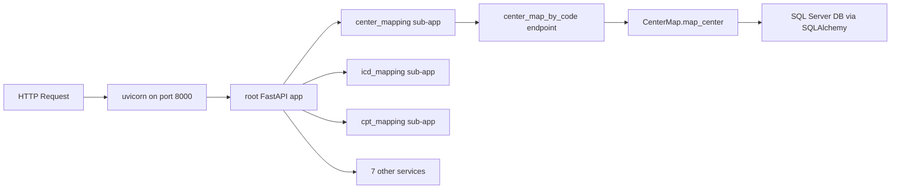
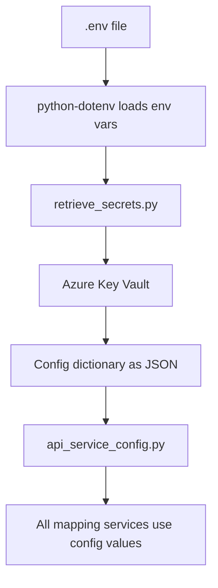

# Debugging Mapping Services Locally — Complete Setup Guide

This guide walks through **every step** a developer needs to set up and debug the mapping services locally on a fresh machine or new project clone.

---

## Table of Contents

1. [Architecture Overview](#architecture-overview)
2. [Prerequisites — Software Installation](#prerequisites--software-installation)
3. [Clone and Project Structure](#clone-and-project-structure)
4. [Python Virtual Environment Setup](#python-virtual-environment-setup)
5. [Azure Authentication Setup](#azure-authentication-setup)
6. [Environment Variables Configuration](#environment-variables-configuration)
7. [VS Code Configuration Files](#vs-code-configuration-files)
8. [The Debug Runner Script](#the-debug-runner-script)
9. [Running the Debugger](#running-the-debugger)
10. [Testing Endpoints](#testing-endpoints)
11. [All Mounted Services and Endpoints](#all-mounted-services-and-endpoints)
12. [Troubleshooting](#troubleshooting)

---

## Architecture Overview

The mapping services are **Azure Functions** apps (Python v2 programming model) that wrap **FastAPI** applications via custom ASGI middleware. For local debugging, we bypass the Azure Functions runtime entirely and run all FastAPI apps directly with **uvicorn**.



### Key Project Files

| File | Purpose |
|------|---------|
| `debug_all_services.py` | Combined debug runner — mounts all 10 FastAPI services under one server |
| `.vscode/launch.json` | VS Code debug configuration (at workspace root) |
| `.env.template` | Environment variable template |
| `.env` | Your local environment variables (not committed to git) |
| `api_service_config.py` | Shared config — pulls all secrets from Azure Key Vault |
| `retrieve_secrets.py` | Key Vault client that fetches the config dictionary |
| `requirements.txt` | Python dependencies |
| `host.json` | Azure Functions host configuration |
| `local.settings.json` | Azure Functions local settings |

All paths below are relative to `structure_function_apis/mapping_services/`.

---

## Prerequisites — Software Installation

### 1. Python 3.9 or higher

Download from https://www.python.org/downloads/

Verify installation:
```bash
python --version
# Should output: Python 3.9.x or higher
```

### 2. Azure CLI

Download from https://learn.microsoft.com/en-us/cli/azure/install-azure-cli-windows

Verify installation:
```bash
az --version
# Should show az cli version
```

### 3. VS Code

Download from https://code.visualstudio.com/

Required extensions:
- **Python** (`ms-python.python`) — for Python IntelliSense and debugging
- **Pylance** (`ms-python.vscode-pylance`) — for type checking
- **Azure Functions** (`ms-azuretools.vscode-azurefunctions`) — optional, for Azure Functions integration

Install via VS Code Extensions panel or command line:
```bash
code --install-extension ms-python.python
code --install-extension ms-python.vscode-pylance
```

### 4. Microsoft ODBC Driver for SQL Server

Download from https://learn.microsoft.com/en-us/sql/connect/odbc/download-odbc-driver-for-sql-server

Choose **ODBC Driver 17** or **ODBC Driver 18** for SQL Server.

Verify installation:
```bash
# Windows - check installed ODBC drivers
odbcconf /q
```

### 5. Git

Download from https://git-scm.com/downloads

---

## Clone and Project Structure

### Clone the repository

```bash
git clone <repository-url>
cd Document%20Processing
```

### Project structure (relevant files)

```
Document%20Processing/
├── .vscode/
│   ├── launch.json          ← VS Code debug config (workspace root)
│   └── tasks.json           ← VS Code tasks
├── structure_function_apis/
│   └── mapping_services/
│       ├── .env.template    ← Copy this to .env
│       ├── .env             ← Your local secrets (gitignored)
│       ├── .venv/           ← Python virtual environment
│       ├── debug_all_services.py    ← Debug runner script
│       ├── requirements.txt
│       ├── api_service_config.py
│       ├── retrieve_secrets.py
│       ├── order_request_service.py
│       ├── host.json
│       ├── local.settings.json
│       ├── center_mapping_service/
│       │   ├── center_mapping_service.py  ← FastAPI app + endpoints
│       │   ├── center.py                  ← Business logic
│       │   ├── center_connect.py          ← DB connection
│       │   ├── function.json
│       │   ├── http_asgi.py
│       │   └── test/
│       │       ├── sample_input.json
│       │       └── test_center.py
│       ├── icd_mapping_service/
│       ├── cpt_mapping_service/
│       ├── patient_matching_service/
│       ├── provider_matching_service/
│       ├── priority_mapping_service/
│       ├── encounter_matching_service/
│       ├── insurance_mapping_service/
│       ├── exam_service/
│       └── validation_service/
```

---

## Python Virtual Environment Setup

### Step 1: Navigate to mapping_services directory

```bash
cd structure_function_apis/mapping_services
```

### Step 2: Create virtual environment

```bash
python -m venv .venv
```

### Step 3: Activate the virtual environment

**Windows (cmd.exe):**
```bash
.venv\Scripts\activate
```

**Windows (PowerShell):**
```powershell
.venv\Scripts\Activate.ps1
```

**macOS/Linux:**
```bash
source .venv/bin/activate
```

You should see `(.venv)` prefix in your terminal prompt.

### Step 4: Install dependencies

```bash
pip install -r requirements.txt
```

This installs ~40+ packages including:
- `azure-functions` — Azure Functions SDK
- `fastapi` — Web framework
- `uvicorn` — ASGI server (used for local debugging)
- `sqlalchemy` — ORM for database access
- `pandas` — Data manipulation
- `azure-keyvault-secrets` — Key Vault access
- `azure-identity` — Azure authentication
- `python-dotenv` — `.env` file loading
- `pydantic` — Data validation
- `azure-monitor-opentelemetry` — Telemetry

### Step 5: Verify installation

```bash
python -c "import fastapi; import uvicorn; import sqlalchemy; print('All imports OK')"
```

---

## Azure Authentication Setup

The mapping services retrieve all configuration from **Azure Key Vault**. The Key Vault client uses `DefaultAzureCredential` which tries multiple authentication methods.

### Option A: Azure CLI Login (Recommended for local dev)

```bash
az login
```

This opens a browser for interactive login. After successful login, `DefaultAzureCredential` will use your Azure CLI session.

### Option B: Service Principal (For CI/CD or shared environments)

Set these environment variables in your `.env`:

```env
AZURE_CLIENT_ID=<your-service-principal-client-id>
AZURE_TENANT_ID=<your-tenant-id>
AZURE_CLIENT_SECRET=<your-service-principal-secret>
```

### Verify Key Vault access

```bash
az keyvault secret list --vault-name ENV-KV-DOCAI-UAT --query "[].name" -o tsv
```

If this returns a list of secret names, you have access.

---

## Environment Variables Configuration

### Step 1: Copy the template

```bash
copy .env.template .env
```

### Step 2: Edit `.env`

Open `structure_function_apis/mapping_services/.env` and configure:

```env
# Azure Key Vault name (where all config secrets are stored)
# Default if not set: ENV-KV-DOCAI-UAT
KEY_VAULT_NAME=ENV-KV-DOCAI-UAT

# Optional: Override Azure identity for Key Vault access
# AZURE_CLIENT_ID=
# AZURE_TENANT_ID=
# AZURE_CLIENT_SECRET=

# Optional: Exclude certain center/CPT IDs during local testing
# CPT_ID_EXCLUDE_LIST=[]
# CENTER_ID_EXCLUDE_LIST=[]

# Optional: Full automation flag (0 = disabled, 1 = enabled)
# FULL_AUTOMATION_FLAG=0
```

### How the config chain works



1. `retrieve_secrets.py` loads `.env` via `load_dotenv()`
2. It reads `KEY_VAULT_NAME` from environment (defaults to `ENV-KV-DOCAI-UAT`)
3. Connects to Key Vault using `DefaultAzureCredential`
4. Fetches the `Config` secret — a JSON dictionary with all DB credentials, table names, connection strings, etc.
5. `api_service_config.py` imports `retrieve_secrets` and unpacks everything into module-level variables

> **Important:** The `.env` file is in `.gitignore` — never commit it.

---

## VS Code Configuration Files

These files must exist at the **workspace root** (the directory you opened in VS Code).

### `.vscode/launch.json`

This file defines the debug configuration. It should be at the root of your VS Code workspace:

```json
{
  "version": "0.2.0",
  "configurations": [
    {
      "name": "Debug ALL Mapping Services (Direct FastAPI)",
      "type": "debugpy",
      "request": "launch",
      "program": "${workspaceFolder}/structure_function_apis/mapping_services/debug_all_services.py",
      "cwd": "${workspaceFolder}/structure_function_apis/mapping_services",
      "env": {
        "KEY_VAULT_NAME": "ENV-KV-DOCAI-UAT",
        "PYTHONPATH": "${workspaceFolder}/structure_function_apis/mapping_services"
      },
      "python": "${workspaceFolder}/structure_function_apis/mapping_services/.venv/Scripts/python.exe",
      "console": "integratedTerminal",
      "justMyCode": false
    }
  ]
}
```

**Key settings explained:**

| Setting | Value | Why |
|---------|-------|-----|
| `program` | Path to `debug_all_services.py` | The script that runs all services |
| `cwd` | `mapping_services` directory | So relative imports work correctly |
| `PYTHONPATH` | `mapping_services` directory | So Python can find `api_service_config`, `order_request_service`, etc. |
| `python` | Path to `.venv/Scripts/python.exe` | Uses the project's virtual environment |
| `justMyCode` | `false` | Allows stepping into library code for deeper debugging |

### `.vscode/tasks.json` (Optional — only for Azure Functions Runtime)

```json
{
  "version": "2.0.0",
  "tasks": [
    {
      "type": "func",
      "label": "func: host start",
      "command": "host start",
      "problemMatcher": "$func-python-watch",
      "isBackground": true,
      "options": {
        "cwd": "${workspaceFolder}/structure_function_apis/mapping_services"
      }
    }
  ]
}
```

---

## The Debug Runner Script

The file `debug_all_services.py` is located at `structure_function_apis/mapping_services/debug_all_services.py`.

### What it does

1. Creates a root FastAPI app
2. Imports each service's FastAPI sub-app
3. Mounts each sub-app at a URL prefix (e.g., `/center_mapping`)
4. Runs everything on uvicorn at `http://localhost:8000`
5. Each import is wrapped in try/except — if one service fails to load, the rest still work

### How it mounts services

```python
# Example from debug_all_services.py
def _import_center():
    from center_mapping_service.center_mapping_service import app
    return app

_mount("/center_mapping", _import_center, "Center Mapping")
```

This pattern is repeated for all 10 services.

---

## Running the Debugger

### Step 1: Open VS Code at the workspace root

```bash
code d:\Envision\Document%20Processing
```

Or open the folder via File → Open Folder.

### Step 2: Open the Run and Debug panel

Press **Ctrl+Shift+D** or click the play icon with a bug in the sidebar.

### Step 3: Select the debug configuration

In the dropdown at the top of the Run and Debug panel, select:

**"Debug ALL Mapping Services (Direct FastAPI)"**

### Step 4: Set breakpoints

Click in the **gutter** (the area left of line numbers) in any file to set a red breakpoint dot.

**Recommended breakpoint locations:**

| File | Line | Description |
|------|------|-------------|
| `center_mapping_service/center_mapping_service.py` | 40 | `center_map_by_code()` — the POST endpoint handler |
| `center_mapping_service/center.py` | 55 | `map_center()` — the business logic method |
| `center_mapping_service/center.py` | 314 | `write_order_request()` — writes results back to JSON |
| `icd_mapping_service/icd_mapping_service.py` | — | ICD mapping endpoint |
| `patient_matching_service/patient_mapping.py` | — | Patient matching endpoint |

### Step 5: Press F5

Or click the green play button in the Run and Debug panel.

**What happens:**
1. VS Code launches `debug_all_services.py` using the `.venv` Python interpreter
2. The script imports `retrieve_secrets.py` which connects to Azure Key Vault
3. `api_service_config.py` loads all configuration
4. Each service's FastAPI app is imported and mounted
5. Uvicorn starts listening on `http://localhost:8000`

**Watch the terminal** — you'll see output like:
```
✅ Mounted Center Mapping            at /center_mapping
✅ Mounted ICD Mapping               at /icd_mapping
✅ Mounted CPT Mapping               at /cpt_mapping
...
============================================================
  Mapping Services - Local Debug Server
  http://localhost:8000
  Swagger docs: http://localhost:8000/docs
============================================================
```

### Step 6: Send a request

See the [Testing Endpoints](#testing-endpoints) section below.

### Step 7: Debug

When a request hits your breakpoint:
- **F10** = Step Over (next line)
- **F11** = Step Into (go inside a function)
- **Shift+F11** = Step Out (exit current function)
- **F5** = Continue (run to next breakpoint)
- **Variables panel** = See current variable values
- **Watch panel** = Add expressions to monitor
- **Debug Console** = Execute Python expressions in the current context

---

## Testing Endpoints

### Health Check (GET)

```bash
curl http://localhost:8000/center_mapping/HealthCenterMapbyCode
```

Expected response:
```json
{"status_code": 200, "status": "Health Check OK"}
```

### Center Mapping (POST)

```bash
curl -X POST http://localhost:8000/center_mapping/CenterMapbyCode ^
  -H "Content-Type: application/json" ^
  -d @structure_function_apis/mapping_services/center_mapping_service/test/sample_input.json
```

### Root Health Check

```bash
curl http://localhost:8000/
```

Returns a list of all mounted services.

### Swagger Interactive Docs

Open in your browser: **http://localhost:8000/docs**

This gives you an interactive UI where you can:
- See all available endpoints
- Try out requests with sample data
- View request/response schemas

---

## All Mounted Services and Endpoints

| URL Prefix | Service | Source File |
|------------|---------|-------------|
| `/center_mapping` | Center Mapping | `center_mapping_service/center_mapping_service.py` |
| `/icd_mapping` | ICD Mapping | `icd_mapping_service/icd_mapping_service.py` |
| `/cpt_mapping` | CPT Mapping | `cpt_mapping_service/run_cpt_map_service.py` |
| `/patient_mapping` | Patient Matching | `patient_matching_service/patient_mapping.py` |
| `/provider_mapping` | Provider Matching | `provider_matching_service/run_provider_matching.py` |
| `/priority_mapping` | Priority Mapping | `priority_mapping_service/priority_mapping_service.py` |
| `/encounter_mapping` | Encounter Matching | `encounter_matching_service/encounter_mapping.py` |
| `/insurance_mapping` | Insurance Mapping | `insurance_mapping_service/run_insurance_mapping_service.py` |
| `/exam` | Exam Service | `exam_service/run_exam_service.py` |
| `/validation` | Validation Service | `validation_service/validate_order_request_json.py` |

---

## Troubleshooting

### Key Vault Authentication Fails

**Error:** `azure.core.exceptions.ClientAuthenticationError`

**Fix:**
1. Run `az login` to authenticate
2. Verify vault access: `az keyvault secret list --vault-name ENV-KV-DOCAI-UAT`
3. If behind a VPN, ensure VPN is connected
4. If using a service principal, verify `AZURE_CLIENT_ID`, `AZURE_TENANT_ID`, `AZURE_CLIENT_SECRET` are set in `.env`

### ODBC Driver Not Found

**Error:** `pyodbc.InterfaceError: ('IM002', '[IM002] [Microsoft][ODBC Driver Manager] Data source name not found')`

**Fix:**
1. Install Microsoft ODBC Driver for SQL Server from https://learn.microsoft.com/en-us/sql/connect/odbc/download-odbc-driver-for-sql-server
2. The driver name comes from Key Vault config (`config.driver`). Ensure your local install matches (e.g., `ODBC Driver 17 for SQL Server` or `ODBC Driver 18 for SQL Server`)

### Database Connection Fails

**Error:** `sqlalchemy.exc.OperationalError: (pyodbc.OperationalError)`

**Fix:**
1. Check if you can reach the SQL Server from your machine (firewall/VPN)
2. DB credentials come from Key Vault: `db_username`, `db_password`, `server`, `database`
3. Test connectivity: `sqlcmd -S <server> -U <username> -P <password> -d <database>`

### `configure_azure_monitor` Fails at Startup

**Error:** Related to Application Insights connection string

**Fix:**
- The `configure_azure_monitor()` call in each service requires `application_insight_conn_string` from Key Vault
- If you want to skip telemetry locally, temporarily comment out the `configure_azure_monitor()` call in the affected service file

### Module Import Errors

**Error:** `ModuleNotFoundError: No module named 'api_service_config'`

**Fix:**
1. Ensure `PYTHONPATH` is set to the `mapping_services` directory (the launch.json config already does this)
2. Verify your venv is activated: `which python` should show the `.venv` path
3. The services use imports like `import api_service_config as config` — these are relative to the `mapping_services` root

### A Service Fails to Mount

**Symptom:** Terminal shows `❌ Failed to mount <service> at <prefix>: <error>`

**Fix:**
- This is non-fatal — other services still work
- Read the error message for the specific import failure
- Common cause: a missing dependency or a service-specific config issue
- You can still debug other services even if one fails

### Breakpoints Not Hit

**Possible causes:**
1. **Wrong URL:** Make sure you're using `http://localhost:8000/...` (not port 7071)
2. **Wrong file:** Ensure the breakpoint is in the file that actually handles the request
3. **`justMyCode` is true:** Set `"justMyCode": false` in launch.json to debug library code too
4. **Service didn't mount:** Check terminal output for mount success/failure messages

### Port 8000 Already in Use

**Error:** `OSError: [Errno 10048] error while attempting to bind on address ('0.0.0.0', 8000)`

**Fix:**
1. Stop any other process using port 8000
2. Or modify the port in `debug_all_services.py` — change `port=8000` to another port
